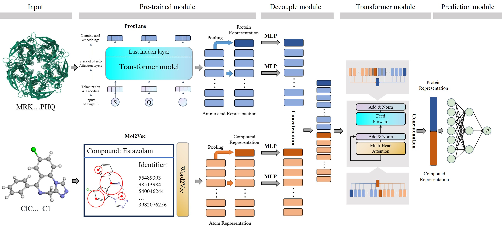

# ColdstartCPI
ColdstartCPI: Induced-fit theory-guided DTI predictive model with improved generalization performance

[](https://colab.research.google.com/github/zhaoqichang/ColdstartCPI/blob/main/Demo/ColdstartCPI_demo.ipynb)

This repository contains the source code and the data.

Predicting compound-protein interactions (CPIs) is a critical step in drug discovery. Existing deep-learning-based methods show promising performance, but generally fail to generalize well to novel compounds and proteins due to the high sparsity of CPI data. To this end, we propose ColdstartCPI, a two-step framework that generates compound and protein representations with unsupervised pre-training, utilizes a Transformer-based structure to unify the pre-trained feature space with the CPI prediction space, and improves interactions for novel compounds and proteins. ColdstartCPI is evaluated under four realistic scenarios and achieves accurate and robust performance against state-of-the-art baselines. Furthermore, we validate the top predictions of ColdstartCPI through comparison with the experimental evidence and docking simulations. Our results indicate that ColdstartCPI provides a unified framework for integrating pre-trained models with CPI prediction tasks, which promises to be a powerful tool for drug discovery.

## ColdstartCPI framwork

<div align="center">
<p></p>
</div>

## Contents
- [Installation](#Installation)
- [Demo data](#Demo-data)
- [Resources](#Resources)
- [Reproducibility](#Reproducibility)
- [Predictions](#Predictions)
- [Contact](#Contact)


## Installation

ColdstartCPI is built on [Python3](https://www.python.org/) and [PyTorch](https://pytorch.org/).
   - Prerequisites: \
       [Python3.*](https://www.python.org/) (version>=3.8)\
	   [gensim](https://github.com/piskvorky/gensim.git) (version=3.8.3)
       [Mol2Vec](https://github.com/samoturk/mol2vec) \
       [bio_embeddings](https://github.com/sacdallago/bio_embeddings) \
       [CUDA Toolkit](https://anaconda.org/anaconda/cudatoolkit) (version>=10.2, for GPU only)
   - Dependencies: \
       [PyTorch](https://pytorch.org/) (version >=1.10.0, <=2.1.0) \
	   [numpy](http://www.numpy.org/) (version = 1.18.3)\
	   [scikit-learn](https://scikit-learn.org/stable/) (version = 1.0.2)\
	   [pandas](https://github.com/pandas-dev/pandas) (version = 1.0.1)\
	   [rdkit](https://github.com/rdkit/rdkit) (version = 2022.9.4)\
	   [tqdm](https://github.com/tqdm/tqdm) \
	   [prefetch_generator](https://github.com/justheuristic/prefetch_generator) \

   - Installation typically requires around 1 to 2 hours, depending on network conditions.

#### System Requirements
`ColdstartCPI` requires only a standard computer with enough RAM to support the in-memory operations. Using GPU could acceralate the training and inference of models.

Recommended Hardware: 128 GB RAM, 40 CPU processors, 4 TB disk storage, >=30 GB GPU 

Recommended OS: Linux (Ubuntu 16.04, CentOS 7, etc.)

#### Installation
Install coldstartcpi, its dependencies, and other required packages in one step using [conda](https://conda.io/docs/) and [environment.yml](environment.yml):
```shell
# download ColdstartCPI
git clone https://github.com/zhaoqichang/ColdstartCPI
cd coldstartcpi

# create environment named coldstartcpi
conda create -n coldstartcpi python=3.8.0

# then the environment can be activated to use
conda activate coldstartcpi

# install bio_embeddings
pip install bio-embeddings==0.2.2

# install tools in requirements.txt
pip install -r requirements.txt
```
  
## Resources
+ README.md: this file.
+ Datasets: The datasets used in paper.
	+ BindingDB_AIBind: 
		+ warm_start: The datasets for warm start.
		+ compound_cold_start: The datasets for compound cold start.
		+ protein_cold_start: The datasets for protein cold start.
		+ blind_start: The datasets for blind start.
		+ feature: Contain the SMILES strings of compounds and amino acid sequences of proteins. 
			+ drug_list.txt: The SMILES strings of compounds
			+ protein_list.txt: Amino acid sequences of proteins
		+ drug_without_feature.txt: Contain the compounds of which the SMILES cannot be recongnized by Mol2Vec.
		+ full_pair.csv: The full dataset with positives and negatives for performance evaluation with scarce data.
		+ full_pair.txt: The full dataset with positives and negatives for performance evaluation with scarce data.
		+ protein_without_feature.txt: Contain the proteins of which the amino acid sequence cannot be recongnized by ProtTrans.
	+ BindingDB: 
		+ warm_start: The datasets for warm start.
		+ compound_cold_start: The datasets for compound cold start.
		+ protein_cold_start: The datasets for protein cold start.
		+ blind_start: The datasets for blind start.
		+ feature: Contain the SMILES strings of compounds and amino acid sequences of proteins. 
			+ drug_list.txt: The SMILES strings of compounds
			+ protein_list.txt: Amino acid sequences of proteins
		+ full_pair.csv: The full dataset with positives and negatives for performance evaluation with scarce data.
	
	+ BioSNAP
		+ warm_start: The datasets for warm start.
		+ compound_cold_start: The datasets for compound cold start.
		+ protein_cold_start: The datasets for protein cold start.
		+ blind_start: The datasets for blind start.
		+ feature: Contain the SMILES strings of compounds and amino acid sequences of proteins. 
			+ drug_list.txt: The SMILES strings of compounds
			+ protein_list.txt: Amino acid sequences of proteins
		+ full_pair.csv: The full dataset with positives and negatives for performance evaluation with scarce data.
		
+ Feature_generation

	+ Mol2Vec
	
	Mol2Vec is customised version of Mol2Vec(https://github.com/samoturk/mol2vec). We recode the mol2vec/feature.py to generate feature matrices of compounds.
	
	You will obtain the feature vectors and matrices of the compounds by following command. **dataname** should be BindingDB_AIBind, BioSNAP, or BindingDB.

		python Mol2Vec.py --dataset dataname
	
	+ ProtTrans
	
	You will obtain the feature vectors and matrices of the proteins by following command. **dataname** should be BindingDB_AIBind, BioSNAP, or BindingDB.
	
		python generator.py --dataset dataname
		
+ Pretrian_models
		
	+ BindingDB_AIbind: The trained models on BindingDB_AIbind dataset under warm start, compound cold start, protein cold start, and blind start.
	
	+ BioSNAP: The trained models on BioSNAP dataset under warm start, compound cold start, protein cold start, and blind start.
	
	+ BindingDB: The trained models on BindingDB dataset under warm start, compound cold start, protein cold start, and blind start.
	
	
+ Train
	+ ColdstartCPI: The codes of training, testing, and model.
		+ ablation
			+ model.py: The codes of WOPretrain, WODecouple, WOTransformer, MolTrans_pretrain, and DrugBAN_pretrain.
			+ dataset.py
			+ train_decouple.py: The code of evaluation of WODecouple .
			+ train_transformer.py: The code of evaluation of WOTransformer.
			+ train_wopretrain.py: The code of evaluation of WOPretrain.
			+ train_DrugBAN_pretrain.py: The code of evaluation of DrugBAN_pretrain.
			+ train_MolTrans_pretrain.py: The code of evaluation of MolTrans_pretrain.
		+ dataset.py
		+ model.py: The code of ColdstartCPI.
		+ train_BindingDB_AIBind.py: The code of evaluation in BindingDB_AIBind under warm start, compound cold start, protein cold start, and blind start.
		+ train_BindingDB_AIBind_missing.py: The code of evaluation in BindingDB_AIBind with scarce data.
		+ train_BindingDB.py: The code of evaluation in BindingDB under warm start, compound cold start, protein cold start, and blind start.
		+ train_BindingDB_missing.py: The code of evaluation in BindingDB with scarce data.
		+ train_BioSNAP.py: The code of evaluation in BioSNAP under warm start, compound cold start, protein cold start, and blind start.
		+ train_BioSNAP_missing.py: The code of evaluation in BioSNAP with scarce data.

+ Case study: The raw files(PDB and pdbqt), settings and results of Docking.

+ Demo: The code and data for demo.

+ Source_Data: Source data and code used in the manuscript to plot individual figures and tables.

## Demo data

We provide ColdstartCPI running demo through a cloud Jupyter notebook on [](https://colab.research.google.com/github/zhaoqichang/ColdstartCPI/blob/main/Demo/ColdstartCPI_demo.ipynb). Note it is based on a small sample dataset due to the resource limitation of a free colab account. 

The **expected output and run time** of demo has been provided in the colab notebook for verification.

Check [demo](/demo) for some demo data to play with: python demo_train.py

+ Dataset：The demo data.

+ model.py: The model.

+ dataset.py

+ demo_train.py: The code of demo.

	+ python demo_train.py

	The results are saved in the Results folder.


## Reproducibility

### Reproducibility with training

For the warm start experiment on the BindingDB_AIBind dataset, you can directly run the following setps.

+ step 1: Generate the feature matrices of compounds and proteins
	+ 1.1 For compounds:
	
		+ python coldstartcpi/Feature_generation/Mol2Vec/Mol2Vec.py --dataset BindingDB_AIBind
		
		The compound_Mol2Vec300.pkl and compound_Atom2Vec300.pkl will generated in [_feature_](/Datasets/BindingDB_AIBind/feature).
		
	+ 1.2 For proteins:
		+ python coldstartcpi/Feature_generation/ProtTrans/generator.py --dataset BindingDB_AIBind
		
		The aas_ProtTransBertBFD1024.pkl will generated in [_feature_](/Datasets/BindingDB_AIBind/feature).
		
+ setp 2: Training and testing

	+ python train_BindingDB_AIBind.py --scenarios warm_start
	
	The results are saved in the [_Results_](/Train/ColdstartCPI/Results) folder.
	
### Reproducibility without training

We also provide models that have been trained for direct testing. For the warm start experiment on the BindingDB_AIBind dataset, you can directly run the following setps.

+ step 1: Make sure that [_feature_](/Datasets/BindingDB_AIBind/feature) already holds the pre-training feature files (i.e., compound_Atom2Vec300.pkl, compound_Mol2Vec300.pkl, and aas_ProtTransBertBFD1024.pkl) for compounds and proteins;

+ setp 2: Move the fold [_BindingDB_AIbind_](/Pretrian_models/BindingDB_AIbind) to the [_Results_](/Train/ColdstartCPI/Results) folder; 

+ setp 3: Loading trained model and testing

	+ python train_BindingDB_AIBind.py --scenarios warm_start
	
The results are saved in the [_Results_](/Train/ColdstartCPI/Results) folder.

## Contact

If any questions, please do not hesitate to contact us at:

Qichang Zhao, zhaoqichang@csu.edu.cn

Jianxin Wang, jxwang@csu.edu.cn

		

	
